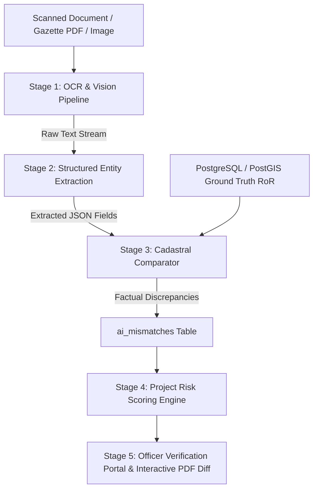
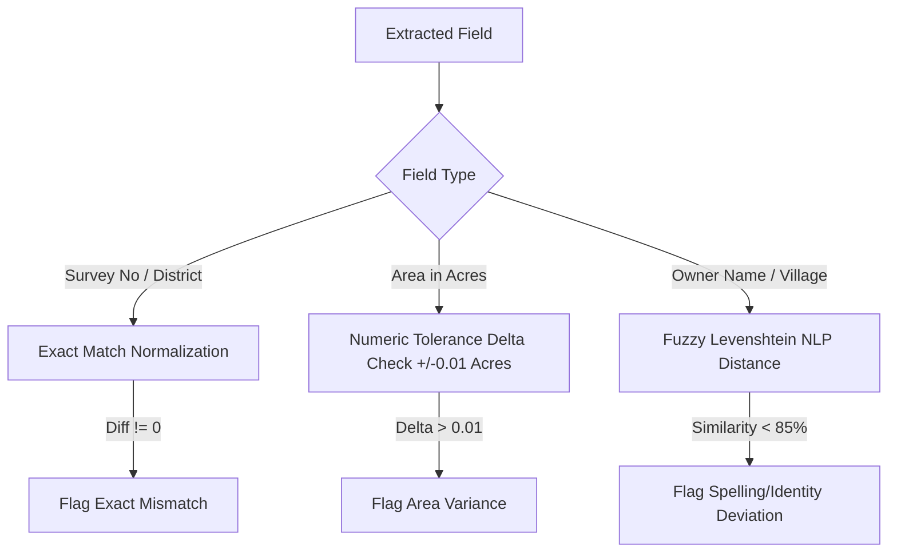

# 🧠 BhoomiSetu — AI System Architecture & Capabilities Guide

> **National Land Acquisition & Rehabilitation Monitoring System (SIH 2026)**  
> Comprehensive technical guide detailing how the AI microservice works, its internal pipeline mechanics, live features, and roadmap of future capabilities.

---

## 📌 Table of Contents
1. [Executive Summary](#1-executive-summary)
2. [How the AI Pipeline Works (End-to-End Mechanics)](#2-how-the-ai-pipeline-works-end-to-end-mechanics)
   - [Stage 1: Document Ingestion & Optical Character Recognition (OCR)](#stage-1-document-ingestion--optical-character-recognition-ocr)
   - [Stage 2: Structured Cadastral Entity Extraction](#stage-2-structured-cadastral-entity-extraction)
   - [Stage 3: Ground-Truth Cadastral Comparator & Verification Engine](#stage-3-ground-truth-cadastral-comparator--verification-engine)
   - [Stage 4: 4-Factor Weighted Project Risk Engine](#stage-4-4-factor-weighted-project-risk-engine)
   - [Stage 5: Explainable AI (XAI) & Human-in-the-Loop Workflow](#stage-5-explainable-ai-xai--human-in-the-loop-workflow)
3. [What You Can Do With This AI System (Live Capabilities)](#3-what-you-can-do-with-this-ai-system-live-capabilities)
4. [Advanced Capabilities & Future Roadmap](#4-advanced-capabilities--future-roadmap)
5. [AI Microservice API Reference](#5-ai-microservice-api-reference)

---

## 1. Executive Summary

In government infrastructure projects (Highways, Railways, Industrial Corridors), land acquisition is frequently stalled by:
- **Title discrepancies** between field survey reports and official Record of Rights (RoR).
- **Acreage variances** due to manual transcription mistakes or outdated survey sheets.
- **Spelling variations** in landholder names across Hindi and English records.
- **Unforeseen project delays** accumulating from unresolved statutory cases and compensation bottlenecks.

The **BhoomiSetu AI System** provides an automated, non-invasive verification layer that reads statutory documents, extracts cadastral metadata, cross-verifies values against official government ground truth, and calculates real-time predictive risk scores.

---

## 2. How the AI Pipeline Works (End-to-End Mechanics)



---

### Stage 1: Document Ingestion & Optical Character Recognition (OCR)
**File**: `ai-service/app/ocr.py`

When a document (e.g. Section 4(1) Notification, Joint Measurement Survey, Possession Certificate) is uploaded:
1. **Digital PDF Detection**: Uses `pdfplumber` for lossless programmatic extraction of tables, text, and metadata streams.
2. **Scanned Images / Scanned PDFs**: Routed to **Tesseract OCR engine** (`pytesseract`) configured with `--psm 6` (Page Segmentation Mode 6: Single uniform block of text / tabular cadastral schedules).

```python
# Extract text based on file format
if suffix in {".png", ".jpg", ".jpeg"}:
    text = pytesseract.image_to_string(Image.open(file_path), config="--psm 6")
elif suffix == ".pdf":
    with pdfplumber.open(file_path) as pdf:
        text = "\n".join([page.extract_text() for page in pdf.pages])
```

---

### Stage 2: Structured Cadastral Entity Extraction
**File**: `ai-service/app/extractor.py`

Raw OCR text is normalized and parsed into 5 primary statutory cadastral fields using pattern matching and entity boundary detection:

| Cadastral Field | Regex Pattern / Parsing Strategy | Type | Example Extracted |
| :--- | :--- | :--- | :--- |
| **`survey_number`** | `Survey\s*No[:\s]+([^\n]+)` | String | `123/2` |
| **`area_acres`** | `Area[:\s]+([\d.]+)\s*acres?` | Float (Numeric) | `2.50` |
| **`village`** | `Village[:\s]+([^\n]+)` | String | `Sarai Khas` |
| **`owner_name`** | `Owner[:\s]+([^\n]+)` | String | `Rameshwar Prasad Sharma` |
| **`district`** | `District[:\s]+([^\n]+)` | String | `Lucknow` |

- **Confidence Diagnostics**: Reports `missing_fields` and boolean `fully_extracted` flag so officers know if a document is only partially legible.

---

### Stage 3: Ground-Truth Cadastral Comparator & Verification Engine
**File**: `ai-service/app/comparator.py`

The system compares extracted values against the official PostgreSQL database (`parcels` table):



1. **Exact Matching**: Applied to `survey_number` and `district`. Any character difference triggers a `HIGH` severity mismatch.
2. **Numeric Tolerance Math**: Applied to `area_acres`. 
   $$\Delta = |\text{Document Area} - \text{Official RoR Area}|$$
   - $\Delta \le 0.01\text{ acres} \rightarrow$ **Matched (Within acceptable tolerance)**.
   - $0.01 < \Delta < 0.20\text{ acres} \rightarrow$ **`MEDIUM` Severity Variance**.
   - $\Delta \ge 0.20\text{ acres} \rightarrow$ **`HIGH` Severity Discrepancy**.
3. **Fuzzy NLP Matching**: Powered by **RapidFuzz** (`fuzz.ratio`) for Indian name spelling variations (e.g. `Rampoor` vs `Rampur`, `Ram Kumar Singh` vs `Rameshwar Prasad Sharma`):
   - $\text{Similarity} \ge 85\% \rightarrow$ **Matched (Minor spelling variation)**.
   - $60\% \le \text{Similarity} < 85\% \rightarrow$ **`LOW` Severity Flag**.
   - $\text{Similarity} < 60\% \rightarrow$ **`HIGH` Severity Flag (Possible identity conflict)**.

---

### Stage 4: 4-Factor Weighted Project Risk Engine
**File**: `ai-service/app/risk.py`

Evaluates project health dynamically across four statutory delay indicators:

$$\text{Project Risk Score} = \min\left(100, S_{\text{cases}} + S_{\text{compensation}} + S_{\text{RR}} + S_{\text{mismatches}}\right)$$

| Factor | Weight | Evaluation Logic | Thresholds |
| :--- | :---: | :--- | :--- |
| **1. Overdue Statutory Cases** | **35 pts** | Evaluates Section 11, Section 19, Section 23 statutory deadlines | 0 overdue = 5 pts<br>1 overdue = 15 pts<br>2 overdue = 25 pts<br>$\ge 3$ overdue = 35 pts |
| **2. Pending Compensation** | **25 pts** | Ratio of unpaid compensation vs total assessed compensation | $\text{Score} = \min\left(25, \frac{\text{Unpaid}}{\text{Assessed}} \times 25\right)$ |
| **3. R&R Scheme Delays** | **20 pts** | Number of delayed Rehabilitation & Resettlement packages | 0 issues = 4 pts<br>1 delayed = 12 pts<br>$\ge 2$ delayed = 20 pts |
| **4. AI Document Mismatches** | **20 pts** | Number of open unresolved cadastral discrepancies | 0 open = 3 pts<br>1 open = 10 pts<br>$\ge 2$ open = 20 pts |

#### Risk Classifications:
- **`LOW` (0 – 39)**: Project proceeding on schedule without critical legal blockers.
- **`MEDIUM` (40 – 64)**: Moderate bottlenecks in compensation or 1 overdue workflow case.
- **`HIGH` (65 – 100)**: Critical risk of litigation, cost escalation, or prolonged delay.

---

### Stage 5: Explainable AI (XAI) & Human-in-the-Loop Workflow

> ⚠️ **Ethical AI Guardrail**: The AI system never declares legal guilt or automatically cancels acquisition. It acts as an **auditable decision-support co-pilot** for the District Land Acquisition Officer (DLAO) and Competent Authority.

- Generates plain-language explanation for every flag.
- Enables officers to mark records as:
  - `DETECTED` $\rightarrow$ `UNDER_REVIEW` $\rightarrow$ `RESOLVED` or `FALSE_POSITIVE`.
- Logs officer remarks into immutable SHA-256 audit trails.

---

## 3. What You Can Do With This AI System (Live Capabilities)

| Feature | Description | Where in UI |
| :--- | :--- | :--- |
| **Instant OCR & PDF Verification** | Upload any document and automatically parse cadastral schedules without manual typing. | `/ai/mismatch` (`+ Run Document Check`) |
| **Side-by-Side Visual Diff** | Dual-column comparison showing official RoR on the left and the uploaded document with highlighted variance on the right. | Mismatch Detail Modal $\rightarrow$ `Compare in PDF →` |
| **Statutory PDF Viewer** | Streams and previews official Government Gazette / Survey documents with OCR entity layers. | `PdfViewerModal` (Direct `View PDF` button) |
| **Parcel-Level Discrepancy Badging** | Red flag (`🚩`) indicators on parcels with active title/area disputes. | `/parcels` list & `/parcels/:id` detail |
| **Multi-Factor Risk Dashboards** | Live progress bars showing the 4 risk drivers for each highway/railway project. | `/projects/:id` & `/dashboard` |
| **Resolution Tracking & Audit Trail** | Record official findings, add officer notes, and resolve discrepancies with full timestamped logs. | `MismatchDetailModal` |

---

## 4. Advanced Capabilities & Future Roadmap

Here are powerful AI capabilities that can be added to BhoomiSetu:

### 🛰️ 1. Satellite & Drone Computer Vision (PostGIS + AI)
- **Automatic Cadastral Boundary Delineation**: Segment high-resolution satellite imagery (Sentinel-2 / Cartosat / Drone orthomosaic) using **Segment Anything Model (SAM)** or **YOLO-v8** to verify boundary coordinates against village revenue maps (*Sajra* maps).
- **Encroachment & Land-Use Change Detection**: Compare historical satellite imagery with current drone feeds to detect unauthorized structures constructed after Section 11 gazette notification.

### 🌐 2. Multi-Lingual Indic OCR & Vernacular Parsing (Bhashini / IndicBERT)
- **Regional Script OCR**: Integrate **AI4Bharat / Bhashini Indic-OCR** to natively parse Hindi (Devanagari), Marathi, Gujarati, Bengali, Tamil, Telugu, and Kannada land records (*Khatauni*, *Khasra*, *Satbara 7/12*).
- **Phonetic Name Transliteration**: Use **Soundex / Indic-Transliteration** to match names written in regional scripts with English Aadhaar / PAN identity databases.

### 🤖 3. Statutory Legal Assistant & GenAI Copilot (LLM)
- **RFCTLARR Act 2013 Compliance Chatbot**: Powered by a Retrieval-Augmented Generation (RAG) pipeline on central and state land acquisition acts. Officers can ask:
  - *"What is the statutory deadline for Section 23 award declaration after Section 19?"*
  - *"How should Solatium (100%) and 12% additional market value interest be computed for Survey 123/2?"*

### 📈 4. Predictive Compensation & Market Valuation Modeling (Machine Learning)
- **Automated Valuation Model (AVM)**: Train an **XGBoost / LightGBM** regression model on historical registered deed prices, circle rates, distance to national highways, and soil fertility ratings to compute fair market value estimates and reduce litigation under Section 64.

### 🔗 5. Blockchain / Cryptographic Document Provenance
- Hash every uploaded statutory document into a tamper-evident SHA-256 ledger to ensure zero post-upload alteration of survey records.

---

## 5. AI Microservice API Reference

The AI microservice exposes fast asynchronous REST endpoints on port `8000`:

### `POST /api/ai/process-document`
Runs full end-to-end OCR, structured field extraction, and cadastral ground truth comparison in a single call.

#### Request:
```json
{
  "file_path": "uploads/joint_survey_123_2.png",
  "official_parcel": {
    "survey_number": "123/2",
    "area_acres": 2.50,
    "village": "Sarai Khas",
    "owner_name": "Rameshwar Prasad Sharma",
    "district": "Lucknow"
  }
}
```

#### Response:
```json
{
  "success": true,
  "raw_text": "GOVERNMENT OF UTTAR PRADESH\nSurvey No: 123/2\nArea: 1.05 acres\nVillage: Sarai Khas\nOwner: Ram Kumar Singh",
  "extracted_fields": {
    "survey_number": "123/2",
    "area_acres": 1.05,
    "village": "Sarai Khas",
    "owner_name": "Ram Kumar Singh",
    "district": "Lucknow"
  },
  "missing_fields": [],
  "fully_extracted": true,
  "has_mismatches": true,
  "mismatch_count": 2,
  "mismatches": [
    {
      "field_name": "area_acres",
      "official_value": "2.5 acres",
      "extracted_value": "1.05 acres",
      "difference": "1.45 acres",
      "severity": "HIGH",
      "explanation": "The documented area is less than the officially recorded cadastral area by 1.45 acres.",
      "status": "DETECTED"
    },
    {
      "field_name": "owner_name",
      "official_value": "Rameshwar Prasad Sharma",
      "extracted_value": "Ram Kumar Singh",
      "difference": "58% dissimilar",
      "severity": "HIGH",
      "explanation": "The owner name in the document differs from the officially recorded value.",
      "status": "DETECTED"
    }
  ]
}
```

---

### `POST /api/ai/calculate-risk`
Calculates weighted project risk metrics.

#### Request:
```json
{
  "overdue_cases_count": 2,
  "total_assessed_comp": 50000000.0,
  "total_paid_comp": 20000000.0,
  "delayed_rr_count": 1,
  "open_mismatches_count": 3
}
```

#### Response:
```json
{
  "score": 72.0,
  "risk_level": "HIGH",
  "model_version": "v1.2-weighted",
  "factors": {
    "overdue_cases": { "score": 25.0, "max": 35.0, "count": 2, "label": "2 statutory cases overdue" },
    "pending_compensation": { "score": 15.0, "max": 25.0, "label": "₹3.00 Cr pending disbursement" },
    "rr_issues": { "score": 12.0, "max": 20.0, "count": 1, "label": "1 rehabilitation activity delayed" },
    "document_mismatches": { "score": 20.0, "max": 20.0, "count": 3, "label": "3 active document discrepancies" }
  }
}
```

---

*Authored for the BhoomiSetu Land Acquisition Modernization Initiative.*
