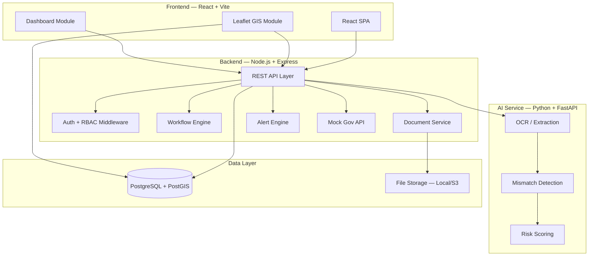
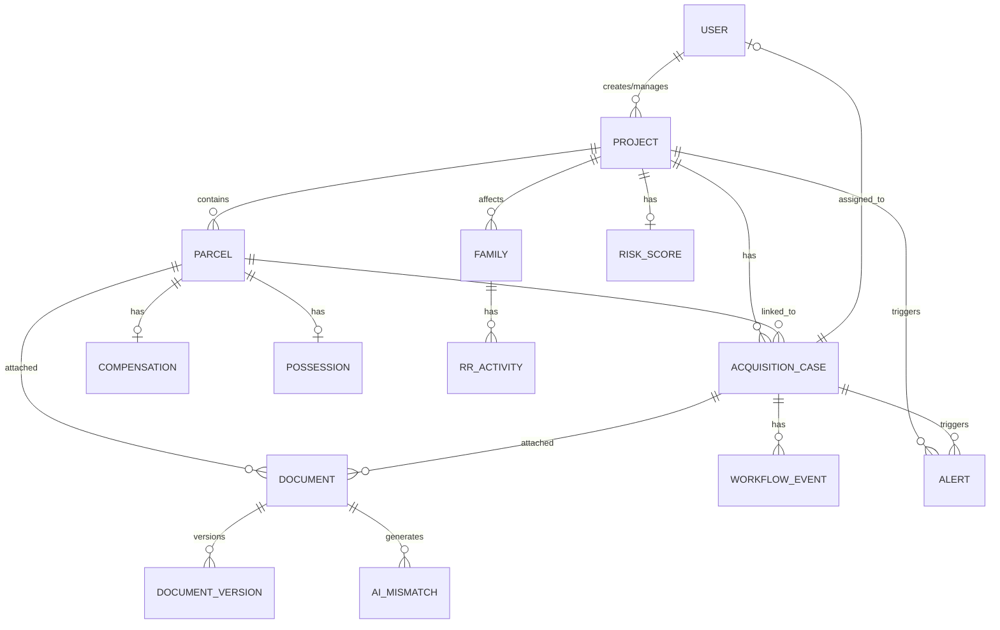
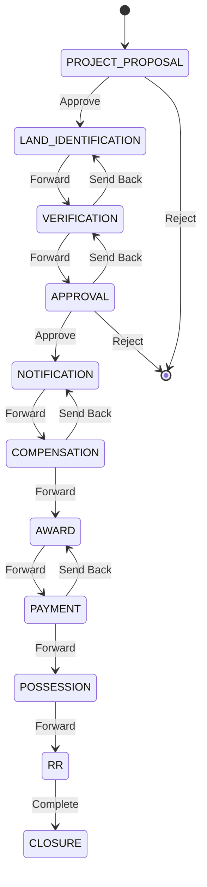

# Phase 0 — Project Analysis & Architecture

## National Land Acquisition & Management System (SIH 2026)

---

## Repository Status

The repository at `c:\Users\samee\Desktop\sih2` is **empty** — contains only the blueprint PDF and prompt markdown file. All code will be built from scratch.

---

## A. Product Architecture

The system is a **modular monolith** with a separate AI microservice. This is the right balance for an SIH prototype — clean separation of concerns without microservice overhead.



### Module Relationships

| Module | Depends On | Provides To |
|--------|-----------|-------------|
| Auth & RBAC | Database | All modules (middleware) |
| Project Management | Auth | Parcels, GIS, Workflow, Dashboard |
| Parcel Management | Projects, Auth | GIS, Workflow, Compensation, Possession |
| GIS | Parcels, Projects (PostGIS) | Frontend map views |
| Workflow Engine | Projects, Parcels, Auth | Cases, Alerts, Audit |
| Document Management | Projects, Parcels, Cases | AI Pipeline, Audit |
| AI Pipeline | Documents, Parcels | Mismatch alerts, Risk scores |
| Compensation | Parcels, Cases | Dashboard, Alerts |
| Possession | Parcels, Cases | Dashboard |
| R&R | Projects, Parcels | Dashboard |
| Dashboard | All data modules | Senior Authority views |
| Alerts & Escalation | Workflow, Deadlines | Notifications |
| Mock Gov API | Parcels | Verification data |

---

## B. User Roles

| Role | Key | Permissions |
|------|-----|-------------|
| **District Land Acquisition Officer** | `DLAO` | Full case management, parcel verification, workflow actions, compensation/possession/R&R, document management, alerts |
| **Project Implementing Agency** | `PIA` | Create/submit projects, define land requirements, view acquisition progress, monitor pending parcels |
| **Senior Government Authority** | `SGA` | National/state/district dashboards, approve escalations, view all projects, risk overview |
| **Field / Revenue Officer** | `FRO` | Assigned parcels, field verification, GPS/photos, evidence upload, remarks, issue flags |
| **System Admin** | `ADMIN` | User management, system configuration (future) |

### Permission Matrix

| Resource | DLAO | PIA | SGA | FRO |
|----------|------|-----|-----|-----|
| Projects — Create | ✗ | ✓ | ✗ | ✗ |
| Projects — View All | ✓ | Own | ✓ | Assigned |
| Parcels — CRUD | ✓ | ✗ | ✗ | ✗ |
| Parcels — View | ✓ | Own Project | ✓ | Assigned |
| GIS — Full | ✓ | ✓ | ✓ | ✓ |
| Workflow — Actions | ✓ | ✗ | Approve | ✗ |
| Documents — Upload | ✓ | ✓ | ✗ | ✓ |
| Compensation — Manage | ✓ | ✗ | View | ✗ |
| Possession — Record | ✓ | ✗ | View | ✓ |
| R&R — Manage | ✓ | ✗ | View | ✗ |
| Dashboard — National | ✗ | ✗ | ✓ | ✗ |
| Dashboard — District | ✓ | ✗ | ✓ | ✗ |
| Alerts — Manage | ✓ | ✗ | ✓ | ✗ |
| Audit Trail | ✓ | Own | ✓ | Own |

---

## C. Frontend Routes / Pages

```
/                           → Redirect to /dashboard or /login
/login                      → Login page
/dashboard                  → Role-based dashboard (National/State/District)
/projects                   → Project list
/projects/new               → Create project (PIA only)
/projects/:id               → Project detail
/projects/:id/gis           → GIS map for project
/projects/:id/parcels       → Parcels list for project
/projects/:id/workflow      → Workflow overview for project
/projects/:id/documents     → Documents for project
/projects/:id/compensation  → Compensation summary
/projects/:id/rr            → R&R summary
/parcels/:id                → Parcel detail page
/parcels/:id/documents      → Documents for parcel
/cases                      → Workflow cases list
/cases/:id                  → Case detail + workflow actions
/documents                  → Document management
/documents/:id              → Document detail + preview
/ai/mismatch                → AI mismatch detection results
/alerts                     → Alerts & escalation
/audit                      → Audit trail
/profile                    → User profile
/field                      → Field officer mobile-optimized view
/mock-api                   → Mock government API demo
```

---

## D. Backend Modules & API Structure

### Module Organization

```
backend/
├── src/
│   ├── config/          → DB, env, constants
│   ├── middleware/       → auth, rbac, error-handler, validation
│   ├── modules/
│   │   ├── auth/        → login, register, JWT, roles
│   │   ├── users/       → user CRUD, profile
│   │   ├── projects/    → project CRUD, geography, timeline
│   │   ├── parcels/     → parcel CRUD, survey, geometry
│   │   ├── gis/         → spatial queries, map data endpoints
│   │   ├── workflow/    → cases, stages, transitions, audit
│   │   ├── documents/   → upload, metadata, versions, access
│   │   ├── compensation/→ assessed, approved, paid, pending
│   │   ├── possession/  → status, date, evidence
│   │   ├── rr/          → families, entitlements, activities
│   │   ├── dashboard/   → KPIs, drill-down, analytics
│   │   ├── alerts/      → deadlines, escalation, risk
│   │   └── mock-api/    → mock government land records API
│   ├── utils/           → helpers, date, formatting
│   └── app.js           → Express app setup
├── seeds/               → Synthetic data seeders
├── migrations/          → Database migrations
└── package.json
```

### REST API Endpoints

#### Auth (`/api/auth`)
| Method | Endpoint | Description |
|--------|----------|-------------|
| POST | `/login` | Login, returns JWT |
| POST | `/logout` | Invalidate token |
| GET | `/me` | Current user + role |

#### Users (`/api/users`)
| Method | Endpoint | Description |
|--------|----------|-------------|
| GET | `/` | List users (admin) |
| GET | `/:id` | User detail |
| PUT | `/:id/profile` | Update profile |

#### Projects (`/api/projects`)
| Method | Endpoint | Description |
|--------|----------|-------------|
| GET | `/` | List projects (filtered by role) |
| POST | `/` | Create project |
| GET | `/:id` | Project detail |
| PUT | `/:id` | Update project |
| GET | `/:id/summary` | Project summary with stats |
| GET | `/:id/timeline` | Project timeline |

#### Parcels (`/api/parcels`)
| Method | Endpoint | Description |
|--------|----------|-------------|
| GET | `/` | List parcels (filterable) |
| POST | `/` | Create parcel |
| GET | `/:id` | Parcel detail (full) |
| PUT | `/:id` | Update parcel |
| GET | `/:id/history` | Parcel audit history |
| GET | `/project/:projectId` | Parcels for a project |

#### GIS (`/api/gis`)
| Method | Endpoint | Description |
|--------|----------|-------------|
| GET | `/parcels` | GeoJSON parcels (filtered) |
| GET | `/corridors/:projectId` | Project corridor GeoJSON |
| GET | `/search` | Spatial search |
| GET | `/stats` | Map-level statistics |

#### Workflow (`/api/workflow`)
| Method | Endpoint | Description |
|--------|----------|-------------|
| GET | `/cases` | List cases |
| POST | `/cases` | Create case |
| GET | `/cases/:id` | Case detail + history |
| POST | `/cases/:id/transition` | Approve/Reject/Forward/SendBack |
| GET | `/cases/:id/audit` | Audit trail for case |
| GET | `/stages` | Available workflow stages |

#### Documents (`/api/documents`)
| Method | Endpoint | Description |
|--------|----------|-------------|
| GET | `/` | List documents |
| POST | `/upload` | Upload document |
| GET | `/:id` | Document metadata |
| GET | `/:id/download` | Download document |
| GET | `/:id/versions` | Version history |
| DELETE | `/:id` | Soft delete |

#### AI (`/api/ai`)
| Method | Endpoint | Description |
|--------|----------|-------------|
| POST | `/extract` | OCR + extract fields from document |
| POST | `/compare` | Compare extracted vs official record |
| GET | `/mismatches` | List detected mismatches |
| GET | `/mismatches/:id` | Mismatch detail |
| POST | `/risk-score/:projectId` | Calculate risk score |

#### Compensation (`/api/compensation`)
| Method | Endpoint | Description |
|--------|----------|-------------|
| GET | `/parcel/:parcelId` | Compensation for parcel |
| POST | `/` | Create compensation record |
| PUT | `/:id` | Update compensation |
| GET | `/project/:projectId/summary` | Project compensation summary |

#### Possession (`/api/possession`)
| Method | Endpoint | Description |
|--------|----------|-------------|
| GET | `/parcel/:parcelId` | Possession status for parcel |
| POST | `/` | Record possession |
| PUT | `/:id` | Update possession |

#### R&R (`/api/rr`)
| Method | Endpoint | Description |
|--------|----------|-------------|
| GET | `/families` | List families |
| POST | `/families` | Register family |
| GET | `/families/:id` | Family detail |
| PUT | `/families/:id` | Update family |
| GET | `/activities` | List R&R activities |
| POST | `/activities` | Create activity |
| PUT | `/activities/:id` | Update activity |
| GET | `/project/:projectId/summary` | R&R summary |

#### Dashboard (`/api/dashboard`)
| Method | Endpoint | Description |
|--------|----------|-------------|
| GET | `/national` | National KPIs |
| GET | `/state/:state` | State-level KPIs |
| GET | `/district/:district` | District-level KPIs |
| GET | `/project/:projectId` | Project-level KPIs |
| GET | `/overdue` | Overdue cases |
| GET | `/risk` | High-risk projects |

#### Alerts (`/api/alerts`)
| Method | Endpoint | Description |
|--------|----------|-------------|
| GET | `/` | List alerts for user |
| PUT | `/:id/acknowledge` | Acknowledge alert |
| GET | `/escalations` | Escalation queue |

#### Mock Government API (`/api/mock-gov`)
| Method | Endpoint | Description |
|--------|----------|-------------|
| GET | `/land-records/:surveyNo` | Mock land record lookup |
| POST | `/sync` | Sync and validate records |
| GET | `/sync-log` | Sync history |

---

## E. Database Schema

### Entity-Relationship Diagram



### Table Definitions

#### `users`
| Column | Type | Notes |
|--------|------|-------|
| id | UUID | PK |
| email | VARCHAR(255) | Unique |
| password_hash | VARCHAR(255) | bcrypt |
| full_name | VARCHAR(255) | |
| role | ENUM | DLAO, PIA, SGA, FRO, ADMIN |
| state | VARCHAR(100) | Jurisdiction |
| district | VARCHAR(100) | Jurisdiction |
| phone | VARCHAR(20) | |
| is_active | BOOLEAN | Default true |
| created_at | TIMESTAMP | |
| updated_at | TIMESTAMP | |

#### `projects`
| Column | Type | Notes |
|--------|------|-------|
| id | UUID | PK |
| project_code | VARCHAR(50) | Unique, e.g. PRJ-2026-001 |
| name | VARCHAR(255) | |
| description | TEXT | |
| project_type | VARCHAR(100) | Highway, Railway, Canal, etc. |
| implementing_agency | VARCHAR(255) | |
| state | VARCHAR(100) | |
| district | VARCHAR(100) | |
| taluk | VARCHAR(100) | |
| total_area_required | DECIMAL(12,4) | In acres |
| total_area_acquired | DECIMAL(12,4) | Computed or cached |
| status | ENUM | PROPOSED, APPROVED, IN_PROGRESS, COMPLETED, CLOSED |
| start_date | DATE | |
| expected_end_date | DATE | |
| created_by | UUID | FK → users |
| created_at | TIMESTAMP | |
| updated_at | TIMESTAMP | |

#### `parcels`
| Column | Type | Notes |
|--------|------|-------|
| id | UUID | PK |
| parcel_code | VARCHAR(50) | Unique, e.g. P-101 |
| project_id | UUID | FK → projects |
| survey_number | VARCHAR(50) | |
| village | VARCHAR(100) | |
| taluk | VARCHAR(100) | |
| district | VARCHAR(100) | |
| state | VARCHAR(100) | |
| area_acres | DECIMAL(10,4) | |
| owner_name | VARCHAR(255) | Sample owner |
| owner_contact | VARCHAR(255) | |
| acquisition_status | ENUM | PROPOSED, NOTIFIED, UNDER_ACQUISITION, ACQUIRED, POSSESSION_TAKEN, RR_ISSUE |
| geometry | GEOMETRY(Polygon, 4326) | PostGIS |
| created_at | TIMESTAMP | |
| updated_at | TIMESTAMP | |

#### `acquisition_cases`
| Column | Type | Notes |
|--------|------|-------|
| id | UUID | PK |
| case_code | VARCHAR(50) | Unique, e.g. LA-2026-001 |
| project_id | UUID | FK → projects |
| parcel_id | UUID | FK → parcels (nullable) |
| current_stage | ENUM | See workflow stages below |
| assigned_to | UUID | FK → users |
| status | ENUM | PENDING, IN_PROGRESS, COMPLETED, SENT_BACK, REJECTED |
| due_date | DATE | |
| is_overdue | BOOLEAN | Computed |
| remarks | TEXT | |
| priority | ENUM | LOW, MEDIUM, HIGH, CRITICAL |
| created_at | TIMESTAMP | |
| updated_at | TIMESTAMP | |

**Workflow Stages Enum:**
```
PROJECT_PROPOSAL → LAND_IDENTIFICATION → VERIFICATION → APPROVAL →
NOTIFICATION → COMPENSATION → AWARD → PAYMENT → POSSESSION → RR → CLOSURE
```

#### `workflow_events`
| Column | Type | Notes |
|--------|------|-------|
| id | UUID | PK |
| case_id | UUID | FK → acquisition_cases |
| from_stage | VARCHAR(50) | |
| to_stage | VARCHAR(50) | |
| action | ENUM | APPROVE, FORWARD, SEND_BACK, REJECT, COMPLETE |
| performed_by | UUID | FK → users |
| remarks | TEXT | |
| created_at | TIMESTAMP | Audit timestamp |

#### `documents`
| Column | Type | Notes |
|--------|------|-------|
| id | UUID | PK |
| document_code | VARCHAR(50) | |
| project_id | UUID | FK → projects (nullable) |
| parcel_id | UUID | FK → parcels (nullable) |
| case_id | UUID | FK → acquisition_cases (nullable) |
| document_type | ENUM | LAND_RECORD, SURVEY_REPORT, NOTIFICATION, AWARD_ORDER, COMPENSATION_DOC, POSSESSION_DOC, RR_EVIDENCE, OTHER |
| title | VARCHAR(255) | |
| description | TEXT | |
| file_path | VARCHAR(500) | Storage path |
| file_name | VARCHAR(255) | Original filename |
| file_size | INTEGER | Bytes |
| mime_type | VARCHAR(100) | |
| version | INTEGER | Default 1 |
| uploaded_by | UUID | FK → users |
| access_level | ENUM | PUBLIC, RESTRICTED, CONFIDENTIAL |
| created_at | TIMESTAMP | |
| updated_at | TIMESTAMP | |

#### `document_versions`
| Column | Type | Notes |
|--------|------|-------|
| id | UUID | PK |
| document_id | UUID | FK → documents |
| version | INTEGER | |
| file_path | VARCHAR(500) | |
| file_name | VARCHAR(255) | |
| file_size | INTEGER | |
| uploaded_by | UUID | FK → users |
| change_notes | TEXT | |
| created_at | TIMESTAMP | |

#### `compensation`
| Column | Type | Notes |
|--------|------|-------|
| id | UUID | PK |
| parcel_id | UUID | FK → parcels |
| case_id | UUID | FK → acquisition_cases (nullable) |
| amount_assessed | DECIMAL(15,2) | |
| amount_approved | DECIMAL(15,2) | |
| amount_paid | DECIMAL(15,2) | |
| payment_status | ENUM | NOT_ASSESSED, ASSESSED, APPROVED, PARTIALLY_PAID, FULLY_PAID |
| payment_date | DATE | |
| payment_reference | VARCHAR(100) | |
| remarks | TEXT | |
| created_at | TIMESTAMP | |
| updated_at | TIMESTAMP | |

#### `possession`
| Column | Type | Notes |
|--------|------|-------|
| id | UUID | PK |
| parcel_id | UUID | FK → parcels |
| case_id | UUID | FK → acquisition_cases (nullable) |
| status | ENUM | NOT_TAKEN, PARTIAL, TAKEN |
| possession_date | DATE | |
| evidence_document_id | UUID | FK → documents (nullable) |
| remarks | TEXT | |
| created_at | TIMESTAMP | |
| updated_at | TIMESTAMP | |

#### `families`
| Column | Type | Notes |
|--------|------|-------|
| id | UUID | PK |
| family_code | VARCHAR(50) | Unique |
| project_id | UUID | FK → projects |
| parcel_id | UUID | FK → parcels (nullable) |
| head_of_family | VARCHAR(255) | |
| members_count | INTEGER | |
| category | ENUM | AFFECTED, DISPLACED |
| entitlement | TEXT | |
| contact | VARCHAR(255) | |
| created_at | TIMESTAMP | |
| updated_at | TIMESTAMP | |

#### `rr_activities`
| Column | Type | Notes |
|--------|------|-------|
| id | UUID | PK |
| family_id | UUID | FK → families |
| activity_type | VARCHAR(100) | Relocation, Employment, etc. |
| description | TEXT | |
| responsible_authority | UUID | FK → users |
| due_date | DATE | |
| completion_date | DATE | |
| status | ENUM | PENDING, IN_PROGRESS, COMPLETED, DELAYED |
| pending_reason | TEXT | |
| evidence_document_id | UUID | FK → documents (nullable) |
| created_at | TIMESTAMP | |
| updated_at | TIMESTAMP | |

#### `ai_mismatches`
| Column | Type | Notes |
|--------|------|-------|
| id | UUID | PK |
| document_id | UUID | FK → documents |
| parcel_id | UUID | FK → parcels |
| field_name | VARCHAR(100) | e.g. "area", "survey_number" |
| official_value | VARCHAR(255) | |
| extracted_value | VARCHAR(255) | |
| difference | VARCHAR(255) | |
| severity | ENUM | LOW, MEDIUM, HIGH, CRITICAL |
| explanation | TEXT | |
| status | ENUM | DETECTED, UNDER_REVIEW, RESOLVED, FALSE_POSITIVE |
| verification_case_id | UUID | FK → acquisition_cases (nullable) |
| detected_at | TIMESTAMP | |
| resolved_at | TIMESTAMP | |

#### `risk_scores`
| Column | Type | Notes |
|--------|------|-------|
| id | UUID | PK |
| project_id | UUID | FK → projects |
| score | DECIMAL(5,2) | 0-100 |
| risk_level | ENUM | LOW, MEDIUM, HIGH, CRITICAL |
| factors | JSONB | Breakdown of contributing factors |
| calculated_at | TIMESTAMP | |

#### `alerts`
| Column | Type | Notes |
|--------|------|-------|
| id | UUID | PK |
| type | ENUM | DEADLINE_APPROACHING, DEADLINE_MISSED, OVERDUE, MISSING_DOC, DATA_MISMATCH, ESCALATION, HIGH_RISK |
| title | VARCHAR(255) | |
| message | TEXT | |
| project_id | UUID | FK → projects (nullable) |
| case_id | UUID | FK → acquisition_cases (nullable) |
| parcel_id | UUID | FK → parcels (nullable) |
| target_user_id | UUID | FK → users |
| is_read | BOOLEAN | Default false |
| is_acknowledged | BOOLEAN | Default false |
| priority | ENUM | LOW, MEDIUM, HIGH, CRITICAL |
| created_at | TIMESTAMP | |
| acknowledged_at | TIMESTAMP | |

#### `audit_log`
| Column | Type | Notes |
|--------|------|-------|
| id | UUID | PK |
| entity_type | VARCHAR(50) | project, parcel, case, document, etc. |
| entity_id | UUID | |
| action | VARCHAR(50) | CREATE, UPDATE, DELETE, TRANSITION, UPLOAD, etc. |
| performed_by | UUID | FK → users |
| old_values | JSONB | |
| new_values | JSONB | |
| ip_address | VARCHAR(50) | |
| created_at | TIMESTAMP | |

#### `mock_gov_sync_log`
| Column | Type | Notes |
|--------|------|-------|
| id | UUID | PK |
| survey_number | VARCHAR(50) | |
| request_data | JSONB | |
| response_data | JSONB | |
| validation_result | ENUM | MATCH, MISMATCH, ERROR |
| synced_at | TIMESTAMP | |

---

## F. GIS Data Model

### Spatial Architecture

- **Database**: PostgreSQL 15+ with PostGIS 3.x extension
- **SRID**: 4326 (WGS 84) — standard for web mapping
- **Frontend**: Leaflet.js with GeoJSON layers

### Parcel Geometry

Each parcel stores a `GEOMETRY(Polygon, 4326)` column. For the SIH prototype, synthetic polygons will be generated around realistic coordinates in Uttar Pradesh (matching the highway project scenario).

### Spatial Queries Needed

```sql
-- Parcels within a project corridor (bounding box)
SELECT * FROM parcels WHERE ST_Intersects(geometry, ST_MakeEnvelope(...));

-- Parcels by district
SELECT * FROM parcels WHERE district = 'Lucknow' AND geometry IS NOT NULL;

-- Area calculation
SELECT ST_Area(geometry::geography) / 4046.86 AS area_acres FROM parcels;

-- GeoJSON export for frontend
SELECT id, parcel_code, survey_number, acquisition_status,
       ST_AsGeoJSON(geometry) AS geojson
FROM parcels WHERE project_id = $1;
```

### Map Layers

| Layer | Source | Style |
|-------|--------|-------|
| Base Map | OpenStreetMap tiles | Default |
| Project Corridor | Project geometry | Blue dashed outline |
| Proposed Parcels | Parcels filtered | Yellow fill |
| Notified Parcels | Parcels filtered | Orange fill |
| Under Acquisition | Parcels filtered | Blue fill |
| Acquired | Parcels filtered | Green fill |
| Possession Taken | Parcels filtered | Dark green fill |
| R&R / Issue | Parcels filtered | Red fill |

---

## G. Workflow States & Transitions



### Transition Rules

| From Stage | Allowed Actions | Next Stage |
|------------|----------------|------------|
| PROJECT_PROPOSAL | Approve, Reject | LAND_IDENTIFICATION or Closed |
| LAND_IDENTIFICATION | Forward, Send Back | VERIFICATION or PROJECT_PROPOSAL |
| VERIFICATION | Forward, Send Back | APPROVAL or LAND_IDENTIFICATION |
| APPROVAL | Approve, Reject, Send Back | NOTIFICATION, Closed, or VERIFICATION |
| NOTIFICATION | Forward | COMPENSATION |
| COMPENSATION | Forward, Send Back | AWARD or NOTIFICATION |
| AWARD | Forward | PAYMENT |
| PAYMENT | Forward, Send Back | POSSESSION or AWARD |
| POSSESSION | Forward | RR |
| RR | Complete | CLOSURE |
| CLOSURE | — | Terminal |

### Audit Event Structure
Every transition creates a `workflow_event` with: case_id, from_stage, to_stage, action, performed_by, remarks, timestamp.

---

## H. AI Pipeline

### Document Mismatch Detection Flow


### Technology

| Component | Technology | Notes |
|-----------|-----------|-------|
| OCR | Tesseract (pytesseract) | For scanned PDFs/images |
| Text extraction | PyPDF2 / pdfplumber | For digital PDFs |
| Field extraction | Regex + heuristics | Extract survey no, area, village, owner |
| Comparison | Python logic | Field-by-field comparison with tolerance |
| Risk scoring | Weighted formula | Based on overdue cases, pending compensation, R&R, mismatches |

### Extraction Fields

| Field | Source | Comparison Logic |
|-------|--------|-----------------|
| Survey Number | Regex pattern | Exact match |
| Area (acres) | Numeric extraction | Tolerance ± 0.01 acres |
| Village | Text matching | Fuzzy match |
| Owner Name | Text extraction | Fuzzy match |
| District | Text extraction | Exact match |

### Important Constraints
- AI is **decision support only** — never declares fraud or legal guilt
- Every mismatch includes human-readable explanation
- Officer must manually verify and resolve

---

## I. Dashboard Structure

### Hierarchy

```
NATIONAL DASHBOARD
├── Total Projects: X
├── Land Proposed: Y acres
├── Land Acquired: Z acres
├── Compensation: ₹A assessed / ₹B paid
├── Affected Families: C
├── R&R Progress: D%
├── Overdue Cases: E
├── High-Risk Projects: F
│
└── Drill Down → STATE
    └── Drill Down → DISTRICT
        └── Drill Down → PROJECT
            └── Drill Down → PARCEL
                └── Drill Down → CASE → DOCUMENT/EVENT
```

### KPI Cards

| KPI | Source | Drill-down |
|-----|--------|-----------|
| Total Projects | `COUNT(projects)` | Project list |
| Land Proposed | `SUM(projects.total_area_required)` | Project details |
| Land Acquired | `SUM(parcels.area WHERE status=ACQUIRED)` | Parcel list |
| Compensation Assessed | `SUM(compensation.amount_assessed)` | Compensation details |
| Compensation Paid | `SUM(compensation.amount_paid)` | Payment details |
| Affected Families | `COUNT(families)` | Family list |
| Displaced Families | `COUNT(families WHERE category=DISPLACED)` | Family list |
| R&R Progress | `COUNT(completed) / COUNT(total) * 100` | R&R details |
| Pending Cases | `COUNT(cases WHERE status=PENDING)` | Case list |
| Overdue Cases | `COUNT(cases WHERE is_overdue=true)` | Case list |
| High-Risk Projects | `COUNT(risk_scores WHERE level>=HIGH)` | Risk details |

---

## J. MVP Boundaries

### In Scope (Must Have)

- [x] Role-based authentication (4 roles)
- [x] Project CRUD with geography
- [x] Parcel management with synthetic data
- [x] Interactive GIS map (Leaflet + PostGIS)
- [x] Parcel detail with all linked data
- [x] Workflow engine (11 stages)
- [x] Document upload with metadata
- [x] AI document mismatch detection
- [x] Compensation tracking (multi-state)
- [x] Possession tracking
- [x] R&R tracking
- [x] Dashboard with drill-down
- [x] Deadline alerts
- [x] Audit trail
- [x] Mock government API
- [x] Risk scoring

### Out of Scope (Not Building)

- ✗ Microservices architecture
- ✗ Generic AI chatbot
- ✗ Blockchain
- ✗ Real government API integration
- ✗ Complex ML models
- ✗ Nationwide real-time GIS
- ✗ Production deployment
- ✗ Multi-factor authentication
- ✗ Email/SMS notifications (in-app only)
- ✗ Offline-first mobile app

---

## K. Proposed Folder Structure

```
sih2/
├── frontend/                    # React + Vite
│   ├── public/
│   │   └── favicon.ico
│   ├── src/
│   │   ├── assets/              # Images, icons
│   │   ├── components/          # Reusable UI components
│   │   │   ├── layout/          # Sidebar, Header, Footer
│   │   │   ├── ui/              # Buttons, Cards, Modals, Tables
│   │   │   ├── forms/           # Form components
│   │   │   ├── charts/          # Chart components
│   │   │   └── map/             # Map components
│   │   ├── pages/               # Route pages
│   │   │   ├── auth/
│   │   │   ├── dashboard/
│   │   │   ├── projects/
│   │   │   ├── parcels/
│   │   │   ├── gis/
│   │   │   ├── workflow/
│   │   │   ├── documents/
│   │   │   ├── ai/
│   │   │   ├── compensation/
│   │   │   ├── possession/
│   │   │   ├── rr/
│   │   │   ├── alerts/
│   │   │   └── field/
│   │   ├── contexts/            # React contexts (Auth, Theme)
│   │   ├── hooks/               # Custom hooks
│   │   ├── services/            # API service functions
│   │   ├── utils/               # Helpers
│   │   ├── styles/              # Global CSS
│   │   ├── App.jsx
│   │   ├── Router.jsx
│   │   └── main.jsx
│   ├── index.html
│   ├── vite.config.js
│   └── package.json
│
├── backend/                     # Node.js + Express
│   ├── src/
│   │   ├── config/
│   │   │   ├── database.js
│   │   │   ├── env.js
│   │   │   └── constants.js
│   │   ├── middleware/
│   │   │   ├── auth.js
│   │   │   ├── rbac.js
│   │   │   ├── errorHandler.js
│   │   │   └── validation.js
│   │   ├── modules/
│   │   │   ├── auth/
│   │   │   ├── users/
│   │   │   ├── projects/
│   │   │   ├── parcels/
│   │   │   ├── gis/
│   │   │   ├── workflow/
│   │   │   ├── documents/
│   │   │   ├── compensation/
│   │   │   ├── possession/
│   │   │   ├── rr/
│   │   │   ├── dashboard/
│   │   │   ├── alerts/
│   │   │   └── mock-api/
│   │   ├── utils/
│   │   ├── seeds/
│   │   │   └── seedData.js
│   │   └── app.js
│   ├── uploads/                 # Document storage
│   ├── package.json
│   └── .env.example
│
├── ai-service/                  # Python + FastAPI
│   ├── app/
│   │   ├── main.py
│   │   ├── ocr.py
│   │   ├── extractor.py
│   │   ├── comparator.py
│   │   ├── risk.py
│   │   └── models.py
│   ├── requirements.txt
│   └── Dockerfile
│
├── database/
│   ├── init.sql                 # Schema creation
│   ├── seed.sql                 # Synthetic data
│   └── migrations/
│
├── docker-compose.yml           # PostgreSQL + PostGIS
├── .env.example
├── .gitignore
└── README.md
```

---

## L. Development Dependencies

### Frontend
| Package | Purpose |
|---------|---------|
| react, react-dom | UI framework |
| react-router-dom | Routing |
| leaflet, react-leaflet | GIS maps |
| recharts | Dashboard charts |
| axios | HTTP client |
| date-fns | Date utilities |
| lucide-react | Icons |

### Backend
| Package | Purpose |
|---------|---------|
| express | HTTP framework |
| pg (node-postgres) | PostgreSQL client |
| bcryptjs | Password hashing |
| jsonwebtoken | JWT tokens |
| multer | File upload |
| cors | CORS middleware |
| dotenv | Environment config |
| uuid | ID generation |
| express-validator | Input validation |
| morgan | HTTP logging |

### AI Service
| Package | Purpose |
|---------|---------|
| fastapi, uvicorn | API framework |
| pytesseract | OCR |
| PyPDF2, pdfplumber | PDF text extraction |
| Pillow | Image processing |
| python-multipart | File upload |

### Infrastructure
| Tool | Purpose |
|------|---------|
| Docker + docker-compose | PostgreSQL + PostGIS container |
| PostgreSQL 15 | Database |
| PostGIS 3.x | Spatial extension |

---

## M. Development Roadmap

| Phase | Description | Estimated Effort |
|-------|-------------|-----------------|
| **0** | Architecture & Planning (this document) | ✅ Complete |
| **1** | Foundation: Frontend + Backend + DB + Layout | Medium |
| **2** | Authentication & RBAC | Medium |
| **3** | Project Management | Medium |
| **4** | Parcel Management | Medium |
| **5** | GIS Module | High |
| **6** | Acquisition Workflow | High |
| **7** | Document Management | Medium |
| **8** | AI Document Mismatch | High |
| **9** | Compensation & Possession | Medium |
| **10** | R&R Module | Medium |
| **11** | Dashboard & Analytics | High |
| **12** | Alerts & Escalation | Medium |
| **13** | Mock Government API | Low |
| **14** | Field / Mobile Experience | Low (if time permits) |
| **15** | Final Integration & Demo | Medium |

---

## N. Important Assumptions

> [!IMPORTANT]
> These assumptions guide the implementation. Please confirm or correct.

1. **Database**: PostgreSQL with PostGIS will run via Docker (docker-compose). The user has Docker installed.
2. **No TypeScript**: The blueprint mentions TypeScript, but for faster prototype development, I'll use **JavaScript (JSX)** unless you specifically want TypeScript. This is an SIH prototype, not a production system.
3. **CSS Framework**: The blueprint suggests Tailwind CSS. I will use **Vanilla CSS** with a professional government design system unless you specifically want Tailwind.
4. **File Storage**: Documents stored locally in `backend/uploads/` directory (not S3) for the prototype.
5. **Synthetic Data**: All demo data (projects, parcels, families, etc.) will use fictional but realistic Indian land acquisition data set in Uttar Pradesh.
6. **AI Service**: The Python FastAPI service for OCR/mismatch detection will be a separate process. For the prototype, it can also be simplified to run inline with Node.js if Python setup is problematic.
7. **No Real Government APIs**: All external integrations are clearly labeled as MOCK.
8. **Single Database**: One PostgreSQL instance serves both application data and spatial (PostGIS) data.
9. **JWT Authentication**: Stateless JWT tokens, no session store needed.
10. **Demo-Ready**: The prototype prioritizes a convincing 3-minute demo flow over production hardening.

---

## O. Open Questions

> [!WARNING]
> Please clarify these before Phase 1 begins:

1. **Do you have Docker installed?** The database (PostgreSQL + PostGIS) will run in a Docker container. If not, we can use a local PostgreSQL installation.
2. **TypeScript or JavaScript?** The blueprint suggests TS, but plain JS is faster for prototyping. Which do you prefer?
3. **Tailwind CSS or Vanilla CSS?** The blueprint suggests Tailwind. Do you want Tailwind (and which version) or vanilla CSS?
4. **Python available?** The AI service uses Python + FastAPI. Is Python already installed on your system? (I see Python 3.11 is installed based on pip output.)
5. **Node.js version?** Which version of Node.js is installed?

---

## Phase 0 — Summary

### Completed
- Full analysis of both blueprint documents (PDF + MD)
- Verified repository is empty (no existing code)
- Defined complete product architecture (modular monolith + AI microservice)
- Defined 5 user roles with permission matrix
- Designed 20+ frontend routes
- Designed 50+ REST API endpoints across 13 modules
- Designed 15 database tables with full column specs
- Designed GIS data model (PostGIS, spatial queries, map layers)
- Designed 11-stage workflow with transition rules
- Designed AI mismatch detection pipeline
- Designed dashboard hierarchy with KPI sources
- Defined MVP boundaries (in/out of scope)
- Proposed complete folder structure
- Listed all development dependencies
- Created 15-phase development roadmap

### Next Phase
**Phase 1 — Foundation**: Frontend setup (React+Vite), Backend setup (Node+Express), Database connection (PostgreSQL+PostGIS), Environment config, Base layout, Design system, Basic routing, Error handling, Basic API structure.

**⏸ STOPPED — Waiting for your instruction to proceed.**
